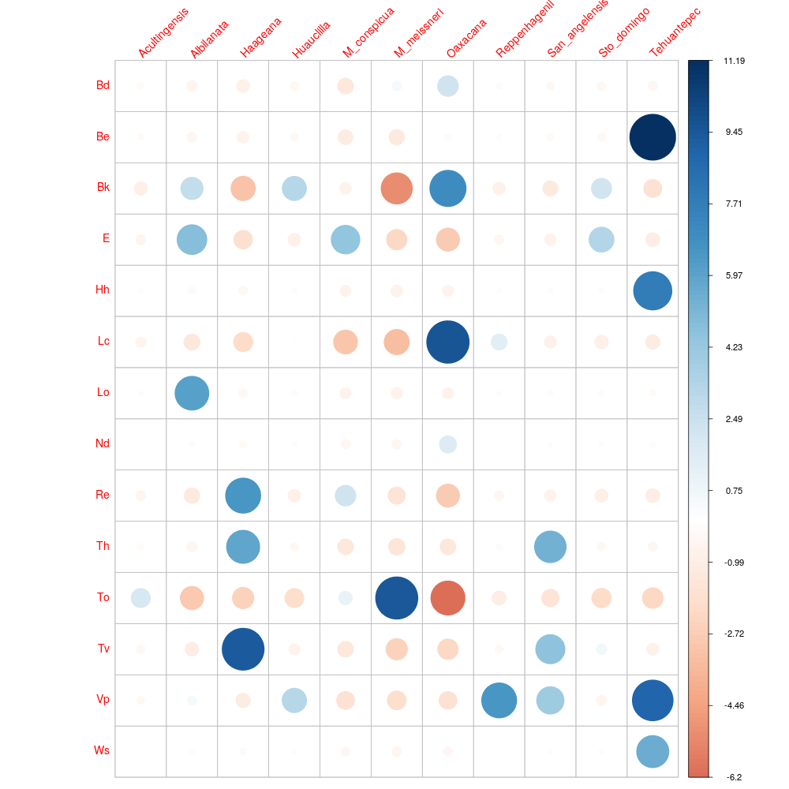

### Mapas de distribución potencial realizados con el paquete Wallace

Número de observaciones por grupo

Resultados de los modelos probados en Wallace, solo se muestra el mejor modelo de acuerdo al criterio de información de Akaike para cada grupo.

##### Mapas de distribución potencial

Mapa con la distribución potencial de *M. conspicua*, *M. haageana*, *M. meissneri* y *M. oaxacana*.

Mapa con la distribución potencial + *M. san-angelensis*.

Mapa con la distribución potencial + *M. albilanata*.

Mapa con la distribución potencial + Huauclilla.

Mapa con la distribución potencial + Tehauntepec.

Mapa con la distribución potencial + Santo Domingo Tonalá.

##### Variables topográficas
Diagrama de caja y bigotes para la elevación.

Residuales de Pearson extraídos de la prueba de chi cuadrada. La prueba de chi-cuadrado evalúa si existe una asociación significativa entre las categorías de las variables analizadas.

Residuos positivos en azul.- los valores positivos en las celdas especifican una atracción (asociación positiva) entre las correspondientes variables de fila y columna.

Los residuos en rojo. implican una repulsión (asociación negativa) entre las correspondientes variables de fila y columna.

Prueba aplicada a los tipos de suelo de la FAO.

Prueba aplicada a las geoformas (Formas del relieve terrestre).

